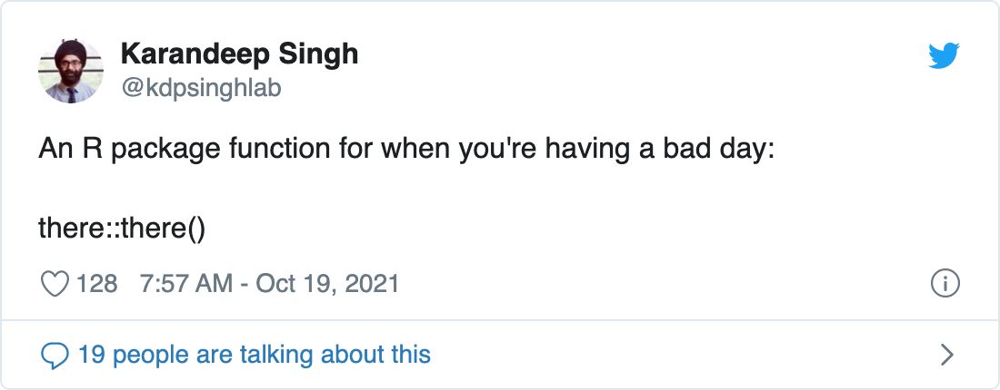

<!-- README.md is generated from README.Rmd. Please edit that file -->

# there



Ask and you shall receive, especially if it’s a fun idea for a useless
package.

## Installation

Download the development version from [GitHub](https://github.com/)
with:

``` r
remotes::install_github("asteves/there")
```

## Example

How do you get a pick me up?

``` r
library(there)
there()
#> [1] "'I regret nothing. The end.' Ron Swanson"

## Or alternatively 
there::there()
#> [1] "Eagles may soar, but weasels do not get sucked into jet engines."
```
